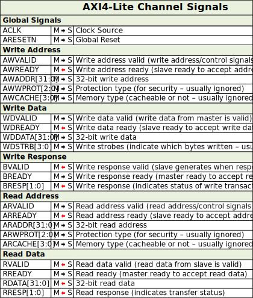

# 140 [fpga][axi] AXI bus

- vhdlwhiz
  - [vhdlwhiz/how-the-axi-style-ready-valid-handshake-works](https://vhdlwhiz.com/how-the-axi-style-ready-valid-handshake-works/)
- [wikipeidia/axibus](https://en.wikipedia.org/wiki/Advanced_eXtensible_Interface)
- zipcpu
  - [axi-story](https://zipcpu.com/formal/2019/09/06/axi-story.html)
  - [easyaxilite](https://zipcpu.com/blog/2020/03/08/easyaxil.html)
- realdigital
  - [realdigital Project 3 The AXI4 Bus](https://www.realdigital.org/doc/cdae58addb3d553a0c05707422339d5d)
- zhihu
  - [深入 AXI4 总线（B）附录·一次从〇开始的 AXI 总线入门研讨](https://zhuanlan.zhihu.com/p/87030667)
  - [深入 AXI4总线（E3）实战：制作一个 AXI 接口 IP](https://zhuanlan.zhihu.com/p/77528158)
- hackster
  - [hackster cospan axi projects](https://www.hackster.io/cospan/projects)
- taterli
  - [taterli tutorial/simple axi lite bram](https://www.taterli.com/9753)
  - [taterli tutorial/datamover](https://www.taterli.com/10116)

---

## Comments

### konosubakonoakua · 2025-10-27T10:36:53Z

## AXI-lite Overview

## AXI-Lite Channel Signals

## AXI-Lite Timing Diagrams

## AXI Channel Signals

